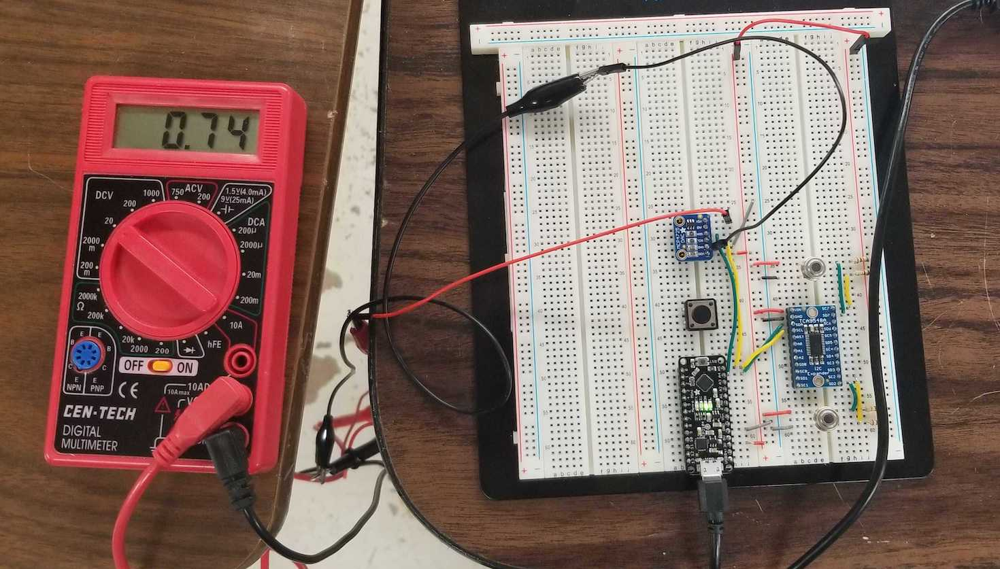

# Process

 *  Multiplexing the IR sensors.
 *  Adding a DAC.
 *  Add a button to select output.

### Next:

JST connections to the displays.


## Multiplexing the IR sensors.

The [ir sensor](https://www.adafruit.com/product/1748) I got is an I2C device which makes things easy to wire up.  Just power the sensor, connect the I2C pins and add pull up resistors and you're done.  The only hard part is making sure you know what pin is what, there's a little tab to help orientate the sensor.

The code is straightforward:

```C
#include <Adafruit_MLX90614.h>

Adafruit_MLX90614 irTempSensor = Adafruit_MLX90614();

void setup() {
  irTempSensor.begin();
}

void loop() {
  double objC = irTempSensor.readObjectTempC();
  double ambC = irTempSensor.readAmbientTempC();
  double objF = irTempSensor.readObjectTempF(); //this is the call that I'm intersted in.
  double ambF = irTempSensor.readAmbientTempF();
}
```

Except it has a fixed address of 0x5A and I need two.  Notice that using the library I never set the address; It's hard coded in `Adafruit_MLX90614.h`.  So I got an [I2C multiplexer](https://www.adafruit.com/product/2717).

The wiring was still relatively simple, just add the multiplexer between the sensors and the arduino:


Note that in this picture I hook up the sensors to pins sd0, sc0, sd1, and sc1.  I have since moved them to sd2, sc2, sd7, and sc7.  The code reflects the 2 and 7 connectons because I'm writing this considerably after the fact.

The code needs a few changes:


Add the wire lib:
```C
#include <Wire.h>
extern "C" { 
#include "utility/twi.h"  // from Wire library, so we can do bus scanning
}
```

Add a tca select helper function to select what sensor connected to the multiplexer we want:
```C
void tcaselect(uint8_t i) {
  if (i > 7) return;
  
  //0x70 is default address for multiplexer
  // You can change it on the multiplexer by shorting the 
  // A0-A2 pins
  Wire.beginTransmission(0x70); 
  Wire.write(1 << i);
  Wire.endTransmission();  
}
```

Then when you want to call one of the sensors you need to use tcaselect() with what pins that sensor is on.

example:
```C
tcaselect(2);
irTemp1.begin(); // start the sensor on pins sda2/scl2
tcaselect(7);
irTemp2.begin(); // start the sensor on pins sda7/scl7

// ...

//  get temp of sensor1 from pins 2 then 7
tcaselect(2);
double temp1 = irTemp1.readObjectTempF();
tcaselect(7);
double temp2 = irTemp2.readObjectTempF();
```


# Adding a DAC

Because this is going on a 1929 motorcycle, we're trying to keep the aesthetic right.  We'll use a volt meter to display the outputs of the arduino.  To do this we'll use a [digital to analog converter](https://www.adafruit.com/product/935).

Lucky us, this is another I2C device with a new address.

To wire it up simply power it with vin and ground.  (Note that the output voltage is rail-to-rail and proportional to the power pin so if you run it from 3.3V, the output range is 0-3.3V. If you run it from 5V the output range is 0-5V.)  Then connect the sda and scl pins to the arduino.


Note that it was ~74F in the shop.  Ignore the button for now.

To change the code:

Add the adafruit library to the top of the file:
```C
#include <Adafruit_MCP4725.h> //dac
```

In the setup function instantiate the dac:
```C
void setup(){
  // some code
  
  //0x62 is default address
  // you can change it to 0x63 by shorting the A0 pin
  dac.begin(0x62); 
  // some code
}
```

Send some data to the dac, probably in your loop:
```C
// Some code

double v;
//Some logic to determine to correct value of v
// v should be between 0 and 4095 (0x0FFF)
dac.setVoltage(v, false); //send to dac.  
// the bool sets a flag to remember in EEPROM for next time it starts

// Some more code
```

I add a helper function to change the scale from some range of temperatures to 0-4095:
```C
double rescaleTempToV(double value){
  // these values go from 0-4.84 volts, what I can get out of the dac
  //    with the volt drop from usb.  I'll change when using the bench power supply
  //    or in the final product.
  
  //change oldMin and oldMax to suit your needs.
  static double newMin = 0;
  static double newMax = 4095;
  static double oldMin = 0;
  static double oldMax = 484;

  double newV = (newMax - newMin) / (oldMax - oldMin) * (value - oldMin) + newMin;
  return newV;
}
```


# Add a button to select output.

I add a push button to change what the voltmeter is outputting.  It can show temp1, temp2, or (soon) the tachometer/spedometer.

For the wiring I just add a button with one side going to ground and the other to pin 8.  I then pull pin 8 high and when the button is pushed it goes low.

The code:

We need to track what options we can show and what is currently being displayed (and therefore what is next when the button is pressed.)

We also need to track the button state so that we can only react to high to low boundries.

At the top of the file add:
```C
// volt display switch
const int PIN_BUTTON = 7;
const int DISP_TEMP1 = 0;
const int DISP_TEMP2 = 1;
int oldButtonState = 0;
int currDispl = 0;
```


Set the button pin as an input.

In setup() add:
```C
  //display switch
  pinMode(PIN_BUTTON, INPUT);
```

In the loop we can't just detect if the button is low and then cycle through the options, we would get triggered for every time loop() is called and the button is down even if the button is pressed only once. So we get the button state and compare it to the old button state to only react to the button being released.

Once we have gone from low to high we just cycle between the DISP_ constants.  Right now the '2' is a little bit magic number-y but it will be cleaned up later.

In loop() add:

```C
// volt display switch
int buttonState = digitalRead(PIN_BUTTON);
// check if the pushbutton is pressed. If it is, the buttonState is HIGH:
if (buttonState == HIGH && oldButtonState == LOW) {
  currDispl = (currDispl + 1) % 2;
}
oldButtonState = buttonState; // remember the state for next time arround
```

Now we can go back to the code we added to send data to the dac and add the logic to determine what to send the if-else statement below can be added:

```C
double v;
//Some logic to determine to correct value of v
// v should be between 0 and 4095 (0x0FFF)

if (currDispl == DISP_TEMP1){
  v = rescaleTempToV(temp1);
} else if (currDispl == DISP_TEMP2){
  v = rescaleTempToV(temp2);
}

dac.setVoltage(v, false); //send to dac.  
// the bool sets a flag to remember in EEPROM for next time it starts

// Some more code
```
