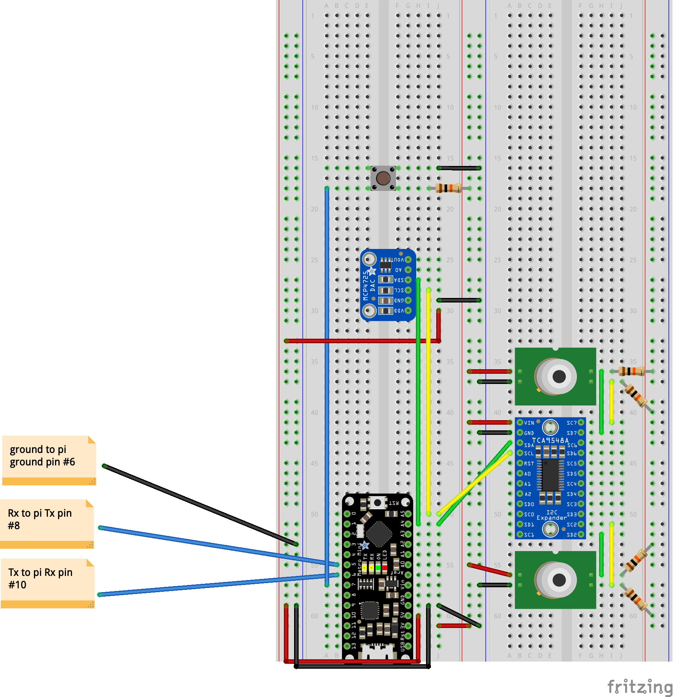

# Motorcycle sensors

Uses two ir sensors to measure the temperature of two cylinders.  The two sensors need to be multiplexed because they share an IC2 adress.

Uses a Hall effect sensor an odometer/speedometer.

Outputs to an analog or digital display. 

The digital display is a RaspberryPi Zero with a display attatched.
The analog display is a volt meter driven by a DAC and allows you to select the mesurement to display with a button press.

The whole thing is controlled with an adafruit metro mini.

## Parts

 *  [ir temperature sensor](https://www.adafruit.com/product/1747) x2

 *  [I2C Multiplexer](https://www.adafruit.com/product/2717)

 *  [DAC](https://www.adafruit.com/product/935)

 *  [PiTFT Display](https://www.adafruit.com/product/2441)

## Wiring

